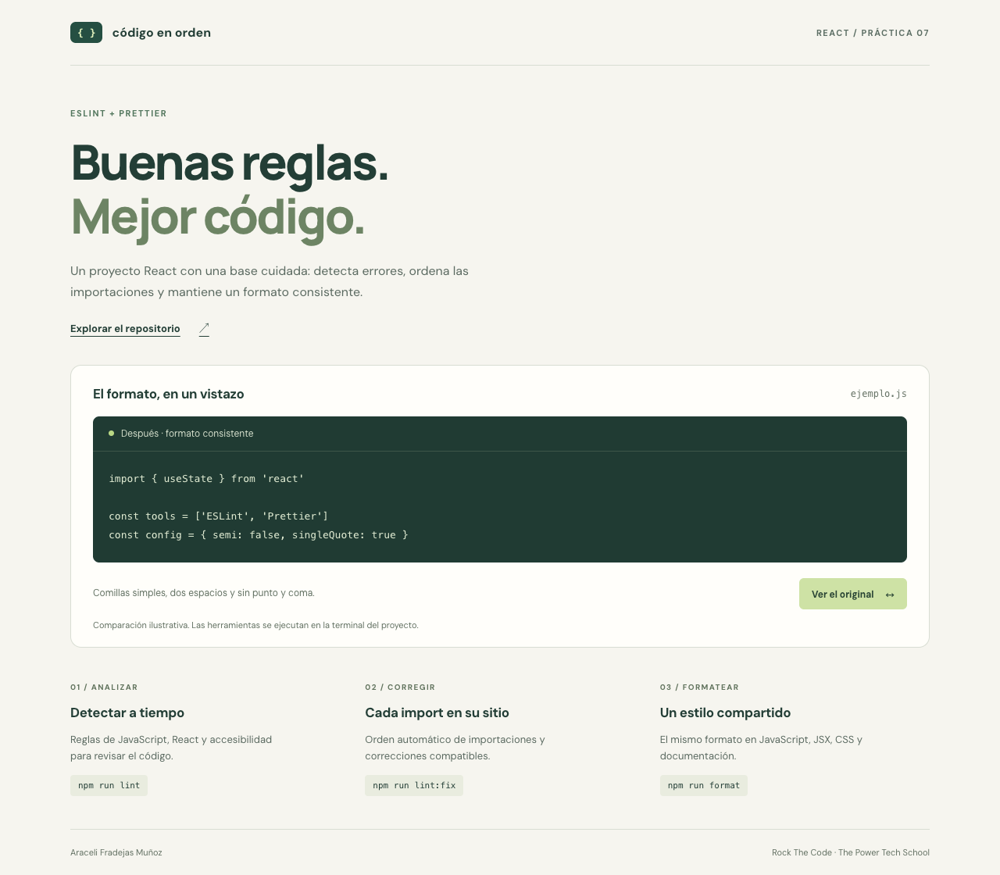
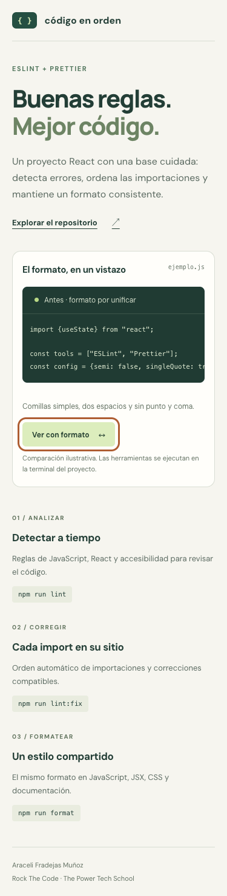

# Memoria del proyecto · ESLint y Prettier

## 1. Resumen

En esta práctica he configurado un proyecto nuevo de React con Vite y JavaScript para mantener un código consistente. ESLint detecta problemas y organiza las importaciones; Prettier aplica las preferencias de formato. He añadido una página de presentación, **Código en orden**, con una comparación visual y los comandos principales del proyecto.

## 2. Enunciado y requisitos

| Requisito                              | Implementación                                                           |
| -------------------------------------- | ------------------------------------------------------------------------ |
| Proyecto Vite con React y JavaScript   | `index.html`, `vite.config.js`, `src/main.jsx` y `src/App.jsx`           |
| Instalar las dependencias solicitadas  | Los nueve paquetes del enunciado se incluyen en `devDependencies`        |
| Configuración ESLint en CommonJS       | `.eslintrc.cjs` con `module.exports` y `root: true`                      |
| Entornos browser, es2021 y node        | Los tres habilitados en `env`                                            |
| Recomendaciones JavaScript y React     | `eslint:recommended` y `plugin:react/recommended`                        |
| Plugins React, accesibilidad e imports | `react`, `jsx-a11y`, `import` y `simple-import-sort`                     |
| JSX y ECMAScript 2021                  | `ecmaFeatures.jsx`, `ecmaVersion: 2021` y `sourceType: 'module'`         |
| No exigir importar React para JSX      | `react/react-in-jsx-scope: off`                                          |
| Ordenar importaciones                  | `simple-import-sort/imports` y `simple-import-sort/exports` como errores |
| Configuración de Prettier              | `.prettierrc.json` con las preferencias del enunciado                    |
| Exclusiones                            | `.eslintignore` y `.prettierignore`                                      |
| Scripts de lint y corrección           | `lint`, `lint:fix`, `format` y `format:check`                            |

## 3. Cómo lo he resuelto

### Configuración y versiones

He utilizado `.eslintrc.cjs` porque el proyecto declara `type: module` y la configuración clásica de ESLint se exporta con CommonJS. El enunciado escribe `eslintrc.cjs` y `prettierrc.json` sin punto; en la entrega llevan el punto inicial para que se descubran automáticamente. `root: true` evita heredar configuraciones de carpetas superiores.

Se fija ESLint 8.57.1 para conservar las propiedades pedidas en el ejercicio. Esta versión está fuera de mantenimiento; el uso del formato clásico responde al enunciado y no es una recomendación para iniciar otros proyectos. Una migración a ESLint moderno requiere adaptar también las exclusiones y la configuración al formato plano.

React se detecta mediante `settings.react.version`. Los plugins `react` y `jsx-a11y` aplican sus recomendaciones. El plugin `import` comprueba imports al comienzo del archivo, separación del resto del código y ausencia de duplicados. `simple-import-sort` se encarga del orden de imports y exports con sus grupos predeterminados; no se añade otra regla de orden que compita con él.

### Integración con Prettier

`plugin:prettier/recommended` ocupa el último lugar de `extends`. Activa los avisos de formato como errores de ESLint y utiliza `eslint-config-prettier` para desactivar reglas de estilo incompatibles. De esta manera, `lint:fix` puede corregir tanto imports como formato.

La configuración utiliza `singleQuote: true`, `semi: false`, `printWidth: 80`, `tabWidth: 2`, `useTabs: false`, `jsxSingleQuote: false`, `trailingComma: 'all'` y `endOfLine: 'auto'`. El ancho de 80 es un objetivo de maquetación de Prettier, no un corte obligatorio de cadenas o enlaces largos. La regla de comillas permite a Prettier elegir otra comilla cuando evita escapes innecesarios.

`format` cubre además CSS, HTML, JSON y Markdown, que no son el objetivo del lint de JavaScript. `format:check` permite verificar estos archivos sin modificarlos.

### Exclusiones y commits

ESLint excluye dependencias, compilaciones, cobertura y documentación. Prettier excluye dependencias, compilaciones, cobertura, el lockfile, los documentos Word, las capturas y el registro generado de verificación. `.gitignore` mantiene fuera del repositorio `node_modules`, `dist`, archivos locales de entorno y el enunciado Word, siguiendo el criterio de las prácticas anteriores. El resumen de requisitos queda documentado en esta memoria.

`pre-commit` ejecuta `lint` y `format:check` antes de confirmar cambios. El repositorio Git existe antes de instalar las dependencias para que se instale el hook. Este comprueba el directorio de trabajo completo, no solo el contenido preparado para el commit; no corrige ni añade archivos por su cuenta. Tras corregir un archivo, hay que volver a prepararlo con `git add`.

Se utiliza `pre-commit` 2 porque la versión 1 arrastraba una dependencia vulnerable de `cross-spawn`. La actualización conserva la configuración pedida y la auditoría final no detecta vulnerabilidades.

### Presentación y accesibilidad

La interfaz combina fondo cálido y tonos verdes, con una estructura adaptable. El botón cambia entre dos cadenas de ejemplo mediante `useState`; no analiza código introducido por el usuario. Su estado se expone con `aria-pressed` y puede accionarse con el teclado. El código largo tiene desplazamiento horizontal dentro de su panel en móvil para no desbordar la página.

Las fuentes DM Sans y Manrope se solicitan a Google Fonts y disponen de alternativas locales. La página incluye la autoría y un enlace al repositorio. La numeración de la cabecera identifica esta entrega dentro de la presentación del proyecto.

## 4. Estructura final

```text
.eslintrc.cjs
.eslintignore
.prettierrc.json
.prettierignore
.gitignore
.nvmrc
index.html
package.json
package-lock.json
vite.config.js
src/
  App.jsx
  App.css
  main.jsx
  index.css
tests/
  tooling.test.js
docs/
  screenshots/
    escritorio.png
    formato-aplicado.png
    movil.png
  verificacion.txt
README.md
MEMORIA.md
```

## 5. Capturas

Presentación inicial en escritorio:


Comparación después de pulsar **Ver con formato**:



Vista móvil de 375 píxeles, con el botón enfocado mediante teclado:



## 6. Validación

Comprobaciones realizadas el 27 de septiembre de 2026 con Node.js 22.23.2 y npm 10.9.8:

- `npm ci`: instalación reproducible a partir de `package-lock.json` completada.
- `npm run lint:fix`: corrección del formato y del orden de importaciones.
- `npm run format`: aplicación del formato a todos los archivos compatibles.
- `npm run check`: lint sin errores ni avisos, formato correcto, cinco pruebas superadas y compilación de producción generada.
- `npm audit`: cero vulnerabilidades detectadas tras actualizar `pre-commit`.
- Comprobación de navegador en Google Chrome con Playwright: cambio de ejemplo con click y con Intro, actualización de `aria-pressed`, ausencia de errores de JavaScript y página sin desbordamiento horizontal a 375 y 320 píxeles.
- Revisión visual de las tres capturas reales de la aplicación.

Las cinco pruebas de `tests/tooling.test.js` verifican detección de variables sin definir y falta de texto alternativo, corrección de imports y exports, reglas de formato y exclusiones de ambas herramientas. Utilizan las APIs reales de ESLint y Prettier sobre ejemplos en memoria, sin introducir archivos incorrectos en la aplicación.

El registro de la comprobación completa está en [docs/verificacion.txt](docs/verificacion.txt). La revisión de navegador utilizó una herramienta externa al proyecto; las cinco pruebas incluidas se reproducen con `npm test` y no requieren instalar un navegador.

## 7. Tecnologías, límites y referencias

React 19, Vite 7, ESLint 8.57.1, Prettier 3 y los plugins indicados en el enunciado. El proyecto no utiliza backend ni almacenamiento persistente. La revisión estática no sustituye las comprobaciones de comportamiento o accesibilidad en navegador. Algunos errores requieren intervención manual aunque exista el comando `lint:fix`.

Documentación técnica consultada:

- [Configuración clásica de ESLint](https://eslint.org/docs/v8.x/use/configure/configuration-files).
- [Configuración de Prettier](https://prettier.io/docs/configuration).
- [Integración de Prettier con ESLint](https://github.com/prettier/eslint-plugin-prettier).
- [Documentación de Vite](https://vite.dev/guide/).

Referencias de estructura documental y autoría:

- [Práctica React Avanzado](https://github.com/AraceliFradejas/ejercicioES7-react-avanzado).
- [Práctica React Router](https://github.com/AraceliFradejas/ejerciciosES7-reactrouter).
- [Práctica de introducción a React](https://github.com/AraceliFradejas/ejerciciosES7-react).

## 8. Autora

**Araceli Fradejas Muñoz** · Proyecto académico del máster Rock The Code de [The Power Tech School](https://thepower.education/thepowermba/tech).
